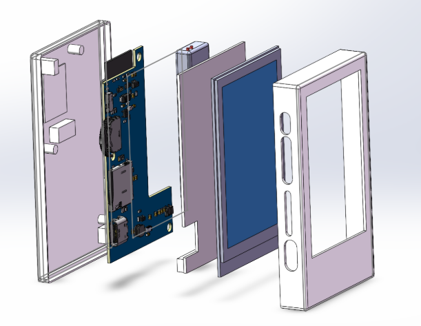
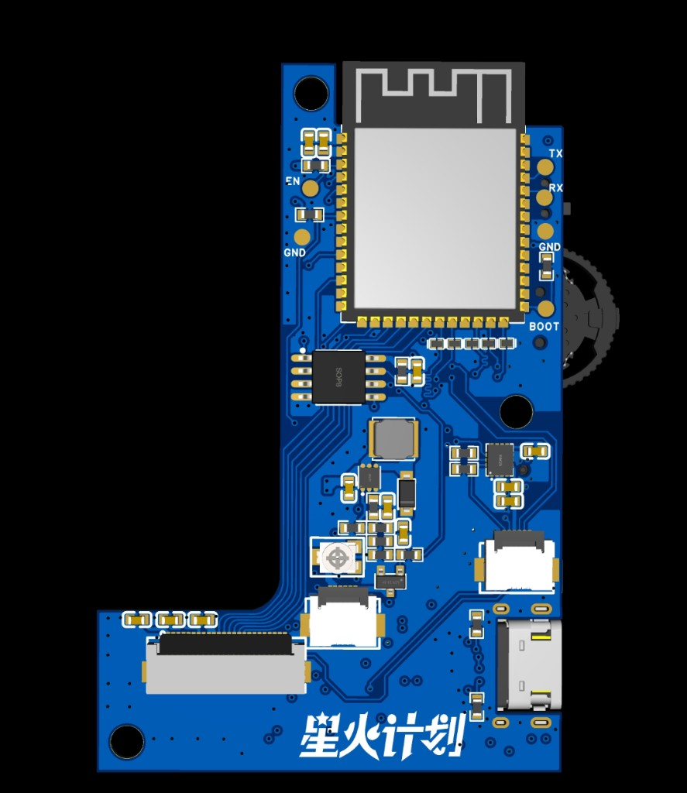

# ESP32-S3 Ebook

## 简介

Ebook 是基于 ESP-IDF 开发的 ESP32-S3 墨水屏电子书阅读器，以 2.7 英寸电子纸屏（GDEY027T91）为核心显示器，通过自研 UI 框架（路由 + 合成器 + 呈现管线）在低功耗墨水屏上实现流畅的多应用交互体验。

支持 Wi-Fi / BLE、TF 卡读写、USB MSC 文件传输、音频播放等功能，内置日历、时钟、阅读器、记事本、音乐播放器等多款应用。

## 功能特性

- **电子纸显示**：GDEY027T91 2.7 英寸墨水屏，支持全刷 / 快刷 / 局刷三种刷新模式
- **触摸交互**：FT6336U 电容触摸屏，支持点击、滑动手势
- **拨码导航**：三段 ADC 拨码开关（上 / 中 / 下），可映射语义动作
- **Wi-Fi 联网**：连接配置、NTP 时间同步、WebSocket、HTTP 客户端
- **蓝牙 BLE**：基于 NimBLE，支持外设 / 中心角色
- **音频播放**：ES8311 编解码器，支持 MP3 / WAV 解码
- **TF 卡存储**：SDMMC 4-bit 总线，FAT32 文件系统，用于用户数据
- **USB MSC**：userdata 分区支持 TinyUSB 大容量存储
- **电池管理**：ADC 电量采样，状态栏实时显示电量
- **OTA 升级(待实现)**：双 ota 分区 + 回滚保护

## 硬件

<p align="center">
  
  <br><em>整机结构图（后壳 → 主板 → 电池/支架 → 墨水屏 → 前壳）</em>
</p>

<p align="center">
  
  <br><em>主板俯视图</em>
</p>

### 主控 & 外设

| 模块 | 型号 / 规格 |
|------|------------|
| SoC | ESP32-S3，240 MHz，Octal PSRAM |
| Flash | 16 MB（QIO 模式） |
| 显示屏 | GDEY027T91，2.7 英寸，264×176，SPI |
| 触控 | FT6336U，I2C，电容式多点触摸 |
| 音频 | ES8311，I2S，扬声器功放 |
| 运动传感器 | QMI8658A，I2C，加速度计 + 陀螺仪 |
| 存储扩展 | TF 卡（SDMMC 4-bit） |
| 电源 | 500mA 锂电池，ADC 电量检测 |

### GPIO 引脚分配

| 功能 | GPIO |
|------|------|
| I2C SDA / SCL | GPIO2 / GPIO1 |
| I2S MCLK / SCLK / LRCK / DI / DO | GPIO41 / 40 / 39 / 42 / 38 |
| I2S 功放使能 | GPIO7 |
| GDEY027T91 MOSI / SCLK / CS / DC / RST / BUSY | GPIO3 / 46 / 9 / 10 / 11 / 12 |
| 屏幕背光 PWM | GPIO17 |
| FT6336U RST / INT | GPIO18 / GPIO5 |
| TF 卡 D0–D3 / CLK / CMD / CD | GPIO14 / 13 / 45 / 48 / 21 / 47 / 4 |
| ADC 拨码开关 | GPIO15 |
| 电池电压采样 | GPIO6 |

## 应用

应用网格共 **12 项**

### 已实现应用

| 应用 | 说明 |
|------|------|
| 阅读 | TXT 书架与正文；字号 / 进度 / 刷新模式；EPUB 规划中 |
| 记事本 | `/int/Ebook/notes` 多文件编辑与保存 |
| 相册 | JPEG（`.jpg` / `.jpeg`），解码后适配墨水屏显示 |
| 画板 | 1-bit BMP 绘制与导出 |
| 音乐 | MP3 / WAV 流式播放（`/int` 与 `/sd`） |
| 天气 | [高德地图 Web 服务](https://lbs.amap.com)：实况 + 预报、31 城切换、IP 定位 |
| 时钟 | 大字时钟 + 闹钟 |
| 日历 | 月视图与年月选择 |
| 电子木鱼 | 敲击计数与音效 |
| 文件管理 | userdata / SD / assets 浏览与操作 |
| 设置 | Wi-Fi、蓝牙、热点、显示、按键、声音、时间、存储、安全、关于等 |

### 占位 / 待实现

| 项目 | 说明 |
|------|------|
| **更新** | 应用网格中的占位 App
| **OTA 在线升级** | 完整升级流程待实现 |
| **EPUB 阅读** | 阅读器扩展格式 |
| **设置 → 电池** | 菜单项已有，页面仍为占位 |

## 软件

### 固件烧录

**前提**：已安装 `esptool`，设备通过 Type-C 连接 USB进行烧录，调试日志信息则通过 UART0（GPIO43 / GPIO44）可以查看。

预编译固件见 [GitHub Releases](https://github.com/CHENXiNNNX/Ebook/releases)，或本地执行 `python scripts/package_firmware.py` 生成到 `dist/`。解压后进入对应版本目录，**烧录偏移与文件名以包内 `FLASH.md` 为准**。

#### 方式一：idf.py（推荐开发者）

```bash
idf.py build flash
```

#### 方式二：esptool 分文件烧录

在发布包的 `flash/` 目录下执行（将 `COMx` 换成实际串口）：

```bash
esptool.py --chip esp32s3 -b 460800 --port COMx write_flash 0x0      bootloader.bin
esptool.py --chip esp32s3 -b 460800 --port COMx write_flash 0x8000   partition-table.bin
esptool.py --chip esp32s3 -b 460800 --port COMx write_flash 0xd000   ota_data_initial.bin
esptool.py --chip esp32s3 -b 460800 --port COMx write_flash 0x20000  Ebook.bin
esptool.py --chip esp32s3 -b 460800 --port COMx write_flash 0x400000 assets.bin
esptool.py --chip esp32s3 -b 460800 --port COMx write_flash 0x800000 userdata.bin
```

#### 方式三：全量合并镜像（工厂 / 首次烧录）

在发布包根目录执行，合并镜像文件名为 `*_flash.bin`：

```bash
esptool.py --chip esp32s3 -b 460800 --port COMx write_flash 0x0 <合并镜像>.bin
```

### 开发环境

- VsCode 等
- 安装 ESP-IDF 插件，选择 SDK 版本 **v5.4 及以上**
- 推荐使用 Linux 或 WSL2 以获得更快的编译速度
- 代码风格遵循 Google C++ Style，提交前请通过 `.clang-tidy` 检查

**天气 App（高德）**：在 `idf.py menuconfig` → `Ebook Configuration` → `高德API Key` 中填写 Web 服务 Key（[lbs.amap.com](https://lbs.amap.com) 申请，需开通「天气查询」与「IP 定位」）。对应 Kconfig 项 `CONFIG_EBOOK_AMAP_WEATHER_KEY`。

### 项目目录结构

```
Ebook/
├── main/
│   ├── app/
│   │   ├── ebook/                # UI 框架 & 应用层
│   │   │   ├── router/           # 路由 + 刷新边表
│   │   │   ├── presenter/        # 上屏管线
│   │   │   ├── composer/         # 帧合成
│   │   │   ├── display/          # DisplayPort 驱动适配
│   │   │   ├── shell/            # 系统页（Lock / Home / AppGrid / AppHost）
│   │   │   ├── apps/             # 内置应用（reader / music / clock / ...）
│   │   │   ├── overlays/         # StatusBar / Toast / Keyboard / ControlCenter
│   │   │   ├── gfx/              # 绘制基础（Canvas / Font / Icon）
│   │   │   ├── ui/               # 控件、UI 主循环（ui_loop.cc）
│   │   │   ├── data/             # 跨 App 共享数据（Persist / SystemState）
│   │   │   ├── input/            # 触摸 / 拨码输入路由
│   │   │   ├── platform/         # 启动链（boot.cc）、电量采样、音频
│   │   │   └── text/             # 文本排版、字符编码
│   │   ├── network/              # Wi-Fi / BLE / NTP / WebSocket / HTTP
│   │   ├── protocol/             # 通信协议
│   │   └── system/               # 任务管理（Task / TaskMgr）、电源、事件
│   ├── bsp/
│   │   ├── config/               # GPIO 引脚配置
│   │   ├── driver/               # 屏幕 / 触摸 / 音频 / 按键 / IMU 驱动
│   │   └── i2c/                  # I2C 总线封装
│   └── common/                   # 公共头文件
├── assets/
│   └── littlefs_assets/          # 字体、图标等内置资源
├── partitions/
│   ├── partition_16mb.csv        # 16MB Flash 分区表
│   └── partition_8mb.csv         # 8MB Flash 分区表
├── scripts/
│   └── package_firmware.py       # 固件打包脚本
├── dist/                         # 预编译固件发布包
│   └── Ebook-vx.x.x/
│       ├── flash/                # 分区镜像文件
│       ├── ota/                  # OTA 升级包
│       ├── manifest.json         # 版本 & SHA256 清单
│       └── FLASH.md              # 烧录说明
├── docs/                         # 数据手册与硬件图片
│   └── images/                   # README 用产品图
├── CMakeLists.txt                # 项目构建入口
├── sdkconfig.defaults            # 通用 Kconfig 默认值
└── sdkconfig.defaults.esp32s3    # ESP32-S3 专属 Kconfig 配置
```

### Flash 分区表（16MB）

| 分区名 | 类型 | 偏移 | 大小 | 用途 |
|--------|------|------|------|------|
| nvs | data/nvs | 0x9000 | 16 KB | Wi-Fi 配置、持久化参数 |
| otadata | data/ota | 0xd000 | 8 KB | OTA 激活分区记录 |
| phy_init | data/phy | 0xf000 | 4 KB | RF 校准参数 |
| ota_0 | app/ota_0 | 0x20000 | 1.9 MB | 应用程序分区 0 |
| ota_1 | app/ota_1 | — | 1.9 MB | 应用程序分区 1（OTA 目标） |
| assets | data/littlefs | 0x400000 | 4 MB | 字体、图标等只读资源（/assets） |
| userdata | data/fat | 0x800000 | 8 MB | 用户数据（FAT + 磨损均衡，/userdata） |

### 依赖组件

| 组件 | 版本 |
|------|------|
| h2zero/esp-nimble-cpp | ^2.5.0 |
| espressif/esp-idf-cxx | ^1.0.2-beta |
| espressif/cjson | ^1.7.19 |
| espressif/esp_tinyusb | ^2.2.0 |
| espressif/esp_websocket_client | ^1.7.0 |
| joltwallet/littlefs | ^1.21.1 |
| espressif/esp_codec_dev | ^1.5.10 |
| espressif/freetype | ^2.14.2 |
| cfscn/esp_lcd_touch_ft6x36 | ^1.0.8 |
| espressif/esp_audio_codec | ^2.5.0 |
| espressif/esp_jpeg | ^1.3.1 |

### 开发者文档

- [Ebook 框架说明](main/app/ebook/README.md)

## 关于项目

本项目为基于 ESP32-S3 开发的电子墨水屏阅读器项目，采用 [MIT 协议](LICENSE) 开源。

如有问题或建议，欢迎提 Issue。
